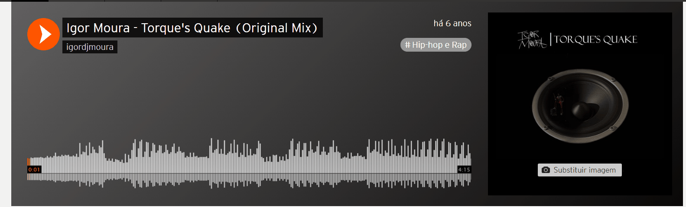

# Projeto com README
Um projeto de teste com um arquivo README 🎶

Sobre minha primeira música!

[](https://soundcloud.com/igor-moura-97/igor-moura-torques-quake-original-mix)

## Teclologias utilizadas
- FL Studio 12 "creaqueado".
- PC com configuração básica.
- Criatividade e vontade de dar os primeiros passos na produção músical.

## Como utilizar

1 - Clone o projeto!

```
git clone <url>
```
2 - Acesse a pasta do projeto!

```
cd repositorio-com-readme
```